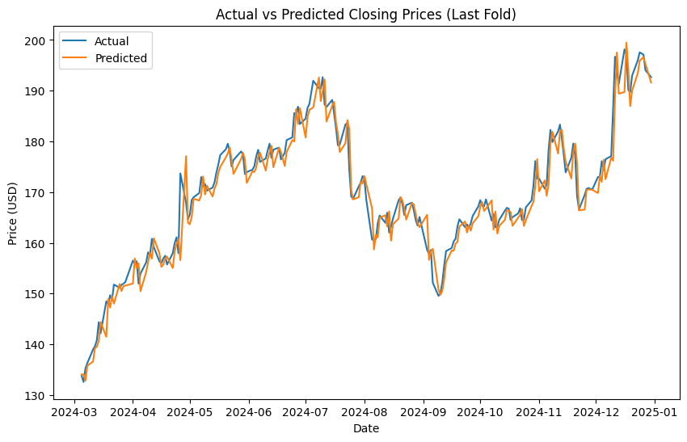
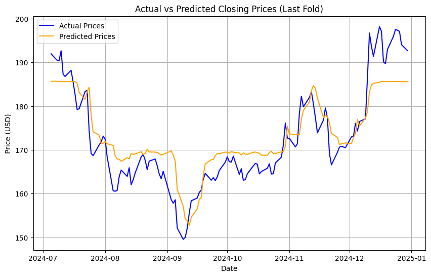

# 📈 Stock Price Prediction: Random Forest vs LSTM  

Proyek ini membandingkan **Random Forest** dan **Long Short-Term Memory (LSTM)** dalam **memprediksi harga saham Google Class C**.  
Dengan menggunakan **data publik saham Google Class C dari Yahoo Finance (2020-2024)**, penelitian ini bertujuan untuk mengevaluasi keakuratan kedua model dalam menangkap pola fluktuasi harga saham.  

📌 **Tools yang digunakan:** Python, Google Colab  
📌 **Dataset:** **Data publik saham Google Class C dari Yahoo Finance**  

## 🚀 Tujuan Penelitian  
✅ **Menganalisis efektivitas model Random Forest dan LSTM dalam prediksi harga saham.**  
✅ **Melakukan feature engineering untuk meningkatkan akurasi model.**  
✅ **Mengevaluasi performa model dengan metrik RMSE, MAE, MAPE, dan R².**  

## 📊 Perbandingan Evaluasi Model  

| **Parameter**       | **LSTM** | **Random Forest** |
|---------------------|---------|------------------|
| **RMSE** (Root Mean Squared Error) | **3.02** | 9.34 |
| **MAE** (Mean Absolute Error) | **2.24** | 7.37 |
| **MAPE** (Mean Absolute Percentage Error) | **1.32%** | 5.45% |
| **R²** (Coefficient of Determination) | **0.95** | 0.14 |
| **Waktu Komputasi** | **29 detik** | 39 detik |
| **Parameter Model** | 50 LSTM Units, Optimizer: Adam, Epochs: 100, Batch Size: 32 | 200 Trees, Max Depth: 20, Min Samples Split: 2 |

📈 **Visualisasi Perbandingan Model:**  

  
*Gambar menunjukkan prediksi LSTM vs harga saham aktual.*  

  
*Gambar menunjukkan prediksi Random Forest vs harga saham aktual.*  

### **Kesimpulan**  
🔹 **LSTM memiliki performa jauh lebih baik dibandingkan Random Forest dalam memprediksi harga saham Google Class C.**  
🔹 **Dengan R² sebesar 0.95, LSTM mampu menangkap pola kompleks dalam data sekuensial.**  
🔹 **Random Forest memiliki interpretabilitas yang baik tetapi kurang cocok untuk data time-series.**  
🔹 **Pemilihan model harus mempertimbangkan jenis data dan kebutuhan analisis.**  

## 📂 Struktur Repository  
```
📁 data/              # Dataset publik saham Google Class C dari Yahoo Finance  
📁 notebooks/         # Jupyter Notebook untuk eksplorasi dan pelatihan model  
📁 images/            # Visualisasi hasil prediksi model
📁 paper/             # Paper hasil penelitian
📄 README.md          # Dokumentasi proyek  
```

## 📢 Sumber Data  
Dataset yang digunakan merupakan **data publik saham Google Class C** yang diperoleh dari **Yahoo Finance**.  
🔗 **[Yahoo Finance - Google Class C Stock Data](https://finance.yahoo.com/quote/GOOG/history/)**  
 

## 📜 Lisensi  
Proyek ini menggunakan **MIT License**.  

---

📈 **Stock Price Prediction: Machine Learning vs Deep Learning** – Analisis Performa Random Forest & LSTM dalam Prediksi Harga Saham! 🚀  
